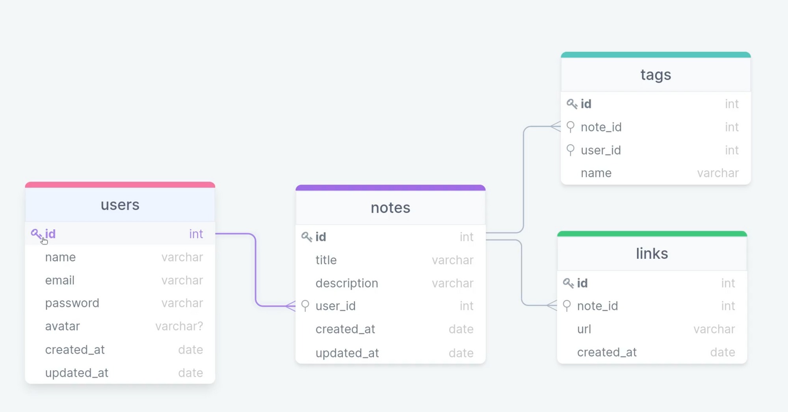

<h1 align="center"> RocketNotes </h1>


<h2>📁 Project</h2>

- This is a complete API built with Node.Js and Express. Insomnia was used to register routes and check their status codes. It was created a database using SQLite, manipulated the database using the Beekeper Studio tool together with the Query Builder Knex.js.

<h2>📌 Structure</h2>

Database Structure:




<h2>💻 Technologies</h2>

This project was built using the following technologies:

- Node.js;
- Express;
- SQLite;
- Knex.js.

<h2>💡 Usage</h2>

To install the application on your machine locally, clone the project, access the folder, install the dependencies and start the server.

```
$ git clonehttps://github.com/desireecvp/rocketnotes-api.git
$ cd rocket-notes-api
$ npm install
$ npm run dev
```
